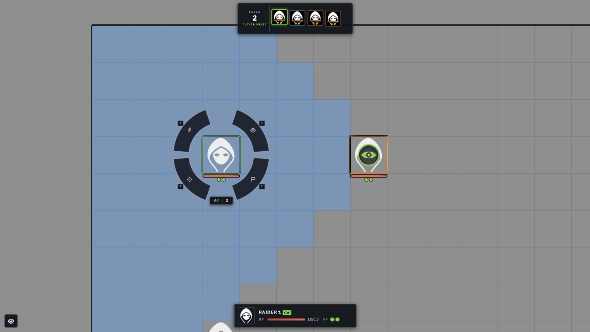
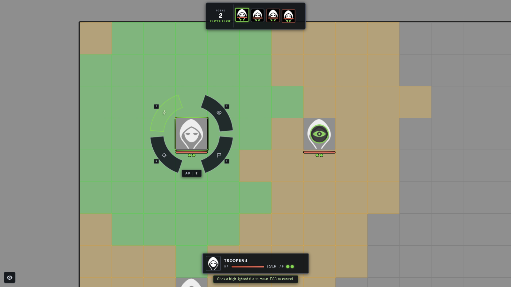
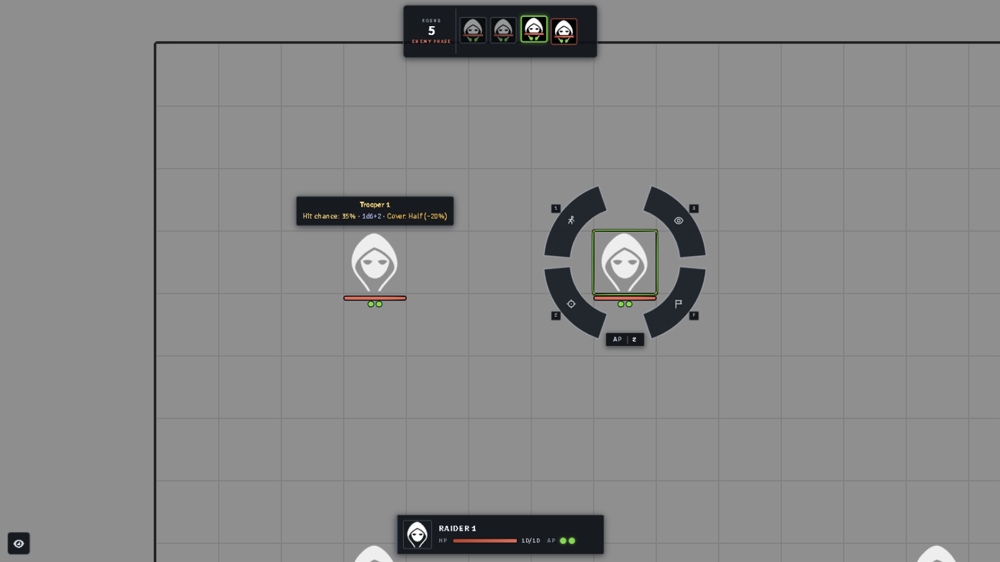
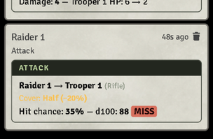
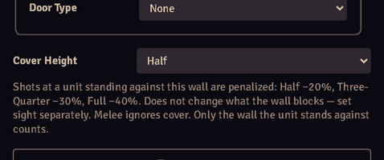

# Crisis Operations Management — COM

Crisis Operations Management (**COM**) is a lightweight, **XCOM-style tactical system** for Foundry Virtual Tabletop: side-based turns, AP-driven actions, click-to-move with a highlighted movement range, hit-chance attacks with a live forecast, overwatch cones, wall cover — and a command ring around the active unit so it plays like a video game, not a spreadsheet.



Designed for *kill-team skirmishes on a square grid*: a handful of units per side, short and punchy fights. Not a simulation — a tactics board.

## A quick tour

### The command ring

Whoever's turn it is gets a **command ring** orbiting their token — four arc plates (Move `1`, Attack `2`, Overwatch `3`, End Turn `F`) plus a COST pill showing the hovered action's AP cost, or the unit's remaining AP when idle. The plates are drawn to hug the token at any zoom level, stay glued to it while panning and zooming, gray out when the action is unavailable, and glow green when their mode is engaged. Everything is reachable by mouse or hotkeys (rebindable in Foundry's keybinding settings).

The **status card** (bottom center) shows the selected unit's portrait, HP and AP; the **turn-order strip** (top center) tracks the whole fight — round number, current phase, and a tile per unit with portrait, HP sliver and AP pips. Active glows green, acted dims, defeated grays out, downed units are skipped automatically.

### Moving

Press **Move** and every tile you can reach lights up: **green** for your current AP, **amber** for what a second AP would buy. Click a tile and the unit walks there. Walls and other tokens block the pathfinding; diagonals included.



### Attacking (and knowing the odds first)

Hover any enemy while your unit is selected and a **forecast** follows the cursor: hit chance, weapon damage, and warnings when the target is out of range or hidden behind a wall. Hit chance is `aim − defense − cover`, rolled on d100; damage comes from the equipped weapon.



Press **Attack** and click the enemy: it gets Foundry's targeting reticle (not selection), the shot fires with a muzzle flash and a tracer bolt (melee swings a slash instead), misses visibly deflect past the target, and the result lands in chat.



### Wall cover

Every wall can be given a **cover height** in the standard wall config: None, Half, Three-Quarter or Full. A unit standing against such a wall is harder to hit from the far side — **Half −20%, Three-Quarter −30%, Full −40%** off the shooter's chance. Only the wall the defender actually stands against counts (the shot line must cross it within a cell of the target), open doors give nothing, and melee ignores cover — so flanking around a fence brings the odds right back.

Cover never changes what a wall blocks: set sight and movement per wall as usual. A low fence is shootable-over; a tall wall that blocks sight needs no cover level at all.



### Overwatch

1 AP puts a unit on overwatch covering a **90° cone** out to weapon range — a blue cone preview sweeps with the mouse, click to lock the facing. Any enemy that *steps into* the cone with line of sight takes a reaction shot at a −20 penalty. Moves are checked tile by tile, so an enemy passing *through* the cone gets shot even if it never stops inside it. The cone stays visible while the unit is selected.

### And the rest

- **Side-based turns** — friendly and neutral tokens act first, then hostiles; initiative is assigned automatically from token disposition.
- **Action Points** — every unit gets 2 AP per turn (per-sheet configurable); hitting 0 AP auto-ends the turn.
- **Enemy AI** — hostile units act on their own: attack the best target in range (cover-aware, prefers low HP and finishers), advance toward the nearest spotted enemy, flee when badly wounded, hold on overwatch when nothing is spotted. Global toggle in settings, per-unit opt-out checkbox on the sheet.
- **Downed units** — at 0 HP a unit gets a skull overlay, is marked defeated in the tracker and skipped. Healing clears it.
- **End of fight** — when one side runs out of living units the encounter ends itself with a victory/defeat/stalemate announcement.
- **Battle mode** — the eye button (bottom-left, `B` hotkey) hides Foundry's interface: tools, players list, navigation, hotbar, sidebar. Just the map and the COM HUDs. Remembered per client.
- **Token status** — an HP bar with AP pips under every unit, and a subtle stationary green frame on the active unit instead of Foundry's rotating marker.
- **Turn order HUD** — draggable, resizable, hideable (a small pill brings it back); position remembered per client.

## Playing

1. **Scene** — use a **square grid** (hex grids are not supported yet). Draw walls as usual; give the ones you want fighting over a Cover Height.
2. **Units** — create `unit` actors. A token's **disposition decides its side**: `Hostile` = enemy side, anything else = player side.
3. **Weapons** — add `weapon` items on the unit sheet (damage formula, range in grid cells, equipped state), or drag them from the **COM Arsenal** compendium (assault rifles, sidearms, shotguns, sniper rifles, melee, explosives — the first dropped weapon is auto-equipped). Without a weapon a unit falls back to 1-damage unarmed strikes.
4. **Combat** — add tokens to the combat tracker and start. Turns are grouped players-then-enemies automatically.

The **status card** (bottom center) shows the selected unit out of combat and hosts the action buttons for freeform play; in combat the actions live on the **command ring** around the active unit.

### Numbers (defaults)

- HP 10, AP 2, Aim 60, Defense 10, Speed 5 (cells per AP)
- Weapon: 1d6+1 damage, range 10 cells
- Hit chance clamp: 5–95 %, overwatch penalty: −20, overwatch cone: 90°
- Cover penalties: Half −20, Three-Quarter −30, Full −40 (per wall)
- All tunable in [`module/config.mjs`](module/config.mjs).

## Installing

**In Foundry:** Administration → Install System → Manifest URL:

```
https://raw.githubusercontent.com/XinSysVTT/foundryvtt-com/main/system.json
```

Requires Foundry Virtual Tabletop v13 or newer (verified on v14).

## How it fits together

| Folder | What lives there |
|---|---|
| `module/` | One ES module per concern: `tactics.mjs` (wiring), `combat.mjs` (turns), `actions.mjs` (attacks/AP), `movement.mjs` (range + walking), `targeting.mjs` (click-to-target + forecast), `overwatch.mjs`/`cone.mjs` (reaction fire geometry), `cover.mjs` (wall cover), `ai.mjs` (enemy turns), `token-actions.mjs` (command ring), `token-overlay.mjs` (under-token bars), `hud.mjs`/`turn-order.mjs` (the DOM HUDs), `icons.mjs` (uniform SVG icon set). |
| `templates/` | Handlebars templates for the HUDs and chat cards. |
| `styles/` | One stylesheet for the whole tactical UI. |
| `packs/` | The COM Arsenal weapon compendium. |
